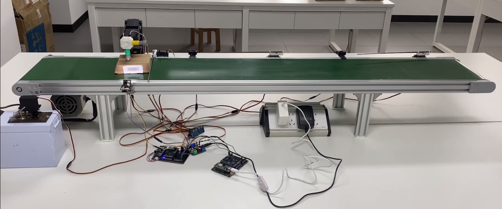
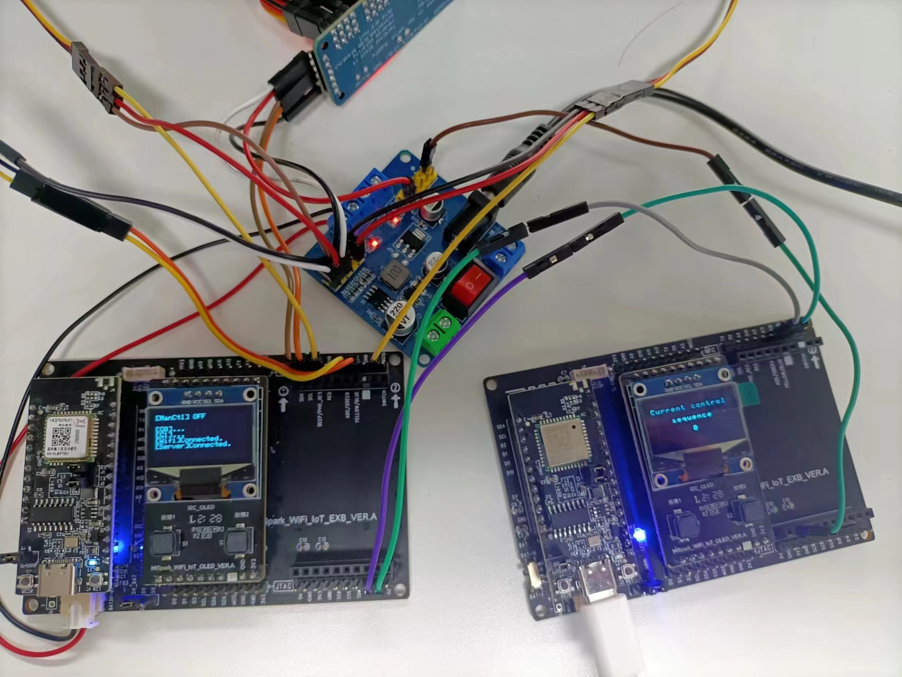

# An ‘Intelligent’ Assembly Line System

## Preface
This is the repository of the source code of group 10410 in 2023 national embedded contest, whose work was originally named *Intelligent Assembly Line System based on Robotic Arm and Vision*. However, since this work was actually neither vision-related nor intelligent, therefore I do not name this repository after the original work.

---

## Introduction
This work uses the Hi3861V100 chip as the main controller, and uses peripheral devices such as barcode scanners, robotic arms, and infrared ranging modules to design a paper box stamping and sorting system. Obtain product codes through barcode scanners, input the result information into the development board, and drive the robotic arm to cover different seals; And according to the product code, the PWM waveform servo drive baffle is output, so that different paper boxes moving on the assembly line are classified into different areas, ultimately achieving the identification, stamping, and sorting functions of the assembly line paper boxes.





## Function
About the detailed function of the work, please read [documents/Introduction.pdf](documents/Introduction.pdf), which introduced this work with details. Note that this document is written by Chinese. If you do not understand Chinese, please use translators to help yourself.

## Code Structure & Deployment
This repository is made up of 4 parts: ctl_host, comm_host, cloud_service and wechat_program. 

1. **ctl_host**: i.e. Control Host Decive. This part is used to drive all the devices of the assembly line and connect the cloud service. The code inside is based on HiSpark Library. Please visit [HiSpark website](https://gitee.com/HiSpark/HiSpark_NICU2023) to see how to set up the environment and compile the codes. After set up the environment, please move the folder to `\\src\vendor\hihope\hispark_pegasus\demo` and modify the `BUILD.gn` like the following lines:

```
import("//build/lite/config/component/lite_component.gni")
lite_component("demo") {
  features = [
    "ctl_host:app"
    # comment other features
  ]
}
```

2. **comm_host**: i.e. Communication Host Decive. This part is used to communication with multiple Control Host Decives and WeChat program. The code inside is also based on HiSpark Library with the same setup-methods as the previous one.

3. **wechat_program**: This part is the code and page design of the WeChat program. Please visit [WeChat website](https://mp.weixin.qq.com/cgi-bin/wx) to learn how to design WeChat programs.

4. **cloud_service**: This part is the code of the online server, which is based on Node.JS. Use `npm install` recover all the packages that are not included in the source code. I recommend use PM2, a package from NPM, to hold the server.